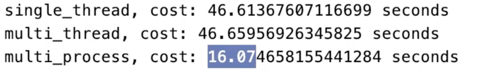

#Readme

1、[单线程和多线程爬虫速度对比](./study/01.multi_thread_craw.py)

2、[多线程数据通讯](./study/02.producer_consumer.py)

3、[使用线程锁保护程序](./study/03.lock_concurrent.py)

4、[线程池的多种使用方法](./study/04.thread_pool.py)

5、[使用线程池对web服务优化-flask](./study/05.Flask_thread_pool.py)

6、[多线程和多进程学习](./study/06.thread_process_cpu_bound.py)

7、[针对CPU密集型计算使用多进程process,进程间的数据共享方法](./study/07.flask_process.py)

8、[使用协程进行爬虫速度会更快0.28秒](./study/08.async_spider.py)

9、[并发使用协程方法Semaphore](./study/09.async_spider_semaphore.py)