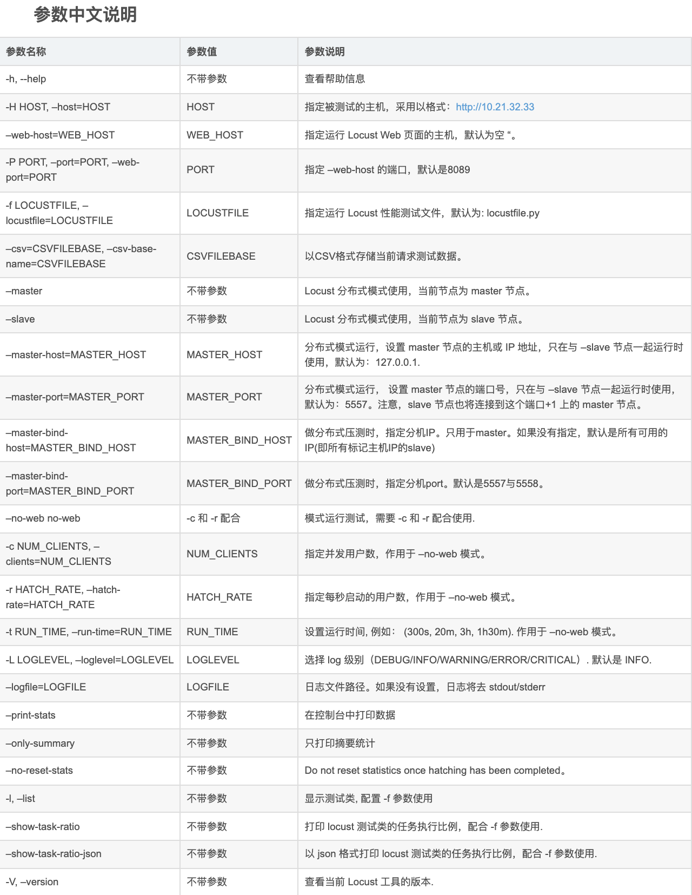

#说明文档
##locust基本运行
###locust -f base_demo.py -H url
##不启动界面 
###locust -f base_demo.py --headless -u 用户数量 -r 每秒启动的用户数 -H url -t 运行时间
### --csv 结果文件
##httprunner+locust 运行：
##可以直接运行json文件，
###locusts -f httprunner_locust.json
###具体使用可以参考 [base_demo.py](./base_demo.py) 和 [fast_user_demo.py](./fast_user_demo.py)
###有点懒就不在这里写了，里面贼详细，各种示例，下面在粘几张命令行图片以供参考
##命令行图片有点旧，分布式执行的时候主机
###locust -f base_demo.py --master
##分布式执行的时候压力机、从机
###locust -f base_demo.py --worker --master-host 主机ip
#Locust命令行中文版
