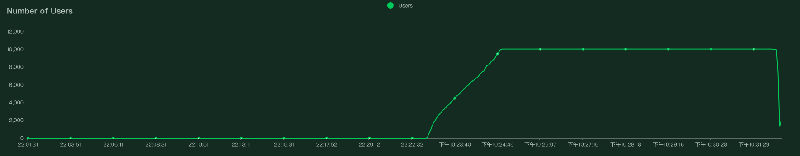

## 个人简历实时版
- [简历查看](./resume/闫旭平求职简历.doc)

## _我的测试项目_

### unittest
- [我的代码存放](./test_game/src)
- [我的case存放](./test_game/testing)
- [pytest框架应用](./test_Calculator)

## 使用PageObject模式
  - [selenium+pytest应用](./web_selenium_test) 
    - [代码存放](./web_selenium_test/Page)
    - [测试case存放](./web_selenium_test/test_case)
  - [Appium+pytest应用](./app_APPium_test)
    - [代码存放](./app_APPium_test/src)
    - [测试case存放](./app_APPium_test/test_case)
  - [APi+pytest](./test_API)
    - [代码存放](./test_API/src)
    - [测试case存放](./test_API/testing/test_wuwork_api_plus.py)
    
### Jnekins practice
- [jenkins_webui_test](./Jenkins_test/jenkins_webui_test)
- [jenkins_api_test](./Jenkins_test/jenkins_Api_test)

## 接口测试
  - [使用mitmdump,API_Mock](/test_API/API_MOCK/api_mock.py)

## 性能测试
  - [使用Locust+python分布式性能测试](./Performance_Test/wuwork_test.py)
    _1615213371.png)
    
    
    
