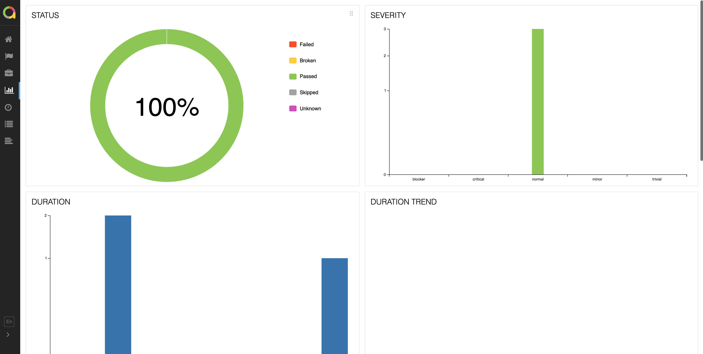
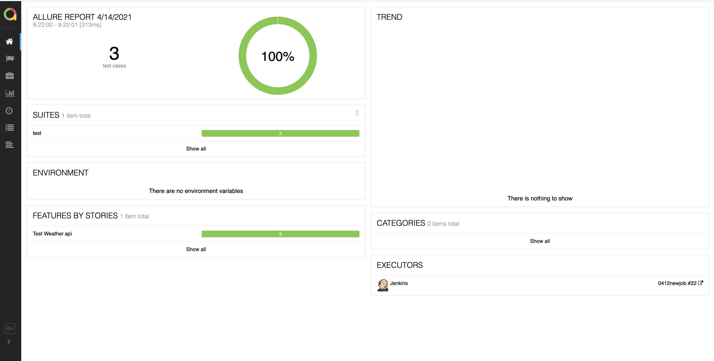
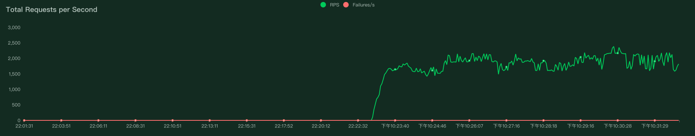

# 我的测试项目
### 体验自己的网站

 
 
_我将会在上面搭建长时间运行的CI/CD、数据库等、web页面等_

- [It's my web](./terrace/myweb) ----->[URL：xuxuclassmate.xyz](https://www.xuxuclassmate.xyz)

#
- [这是一个testcase管理平台（Vue+Flask）](./terrace/newprojecttest)
- so it's me [vue自学学习笔记](./treeace/front_end)
    

### unittest
- [我的代码存放](./test_game/src)
- [我的case存放](./test_game/testing)
- [pytest框架应用](./test_Calculator)

## 使用PageObject模式
  - [selenium+pytest应用](./web_selenium_test) 
    - [代码存放](./web_selenium_test/Page)
    - [测试case存放](./web_selenium_test/test_case)
  - [Appium+pytest应用](./app_APPium_test)
    - [代码存放](./app_APPium_test/src)
    - [测试case存放](./app_APPium_test/test_case)
  - [APi+pytest](./test_API)
    - [代码存放](./test_API/src)
    - [测试case存放](./test_API/testing/test_wuwork_api_plus.py)

## 接口Mock
  - [使用mitmdump,API_Mock](/test_API/API_MOCK/api_mock.py)
    
### Jnekins practice
- [jenkins_webui_test](./Jenkins_test/jenkins_webui_test)
- [jenkins_api_test](./Jenkins_test/jenkins_Api_test)
    #### jenkins自动化测试结果
  - [执行日志](./Jenkins_test/jenkins_Api_test/email_log/build.log)
  - [执行结束已发送邮件](./Jenkins_test/jenkins_Api_test/email_log/Jenkins构建提示：0412newjob%20-%20Build%20%23%201%20-%20Successful!.eml)
  - [生成的Allure文件](./Jenkins_test/jenkins_Api_test/allure-report)
    
    

### Creeper
 -[爬虫学习，进程、线程、协程使用，以及各种Demo](./Creeper/study)

## 性能测试
  - [使用Locust+python分布式性能测试](./Performance_Test/wuwork_test.py)
    _1615213371.png)
    
    
    
